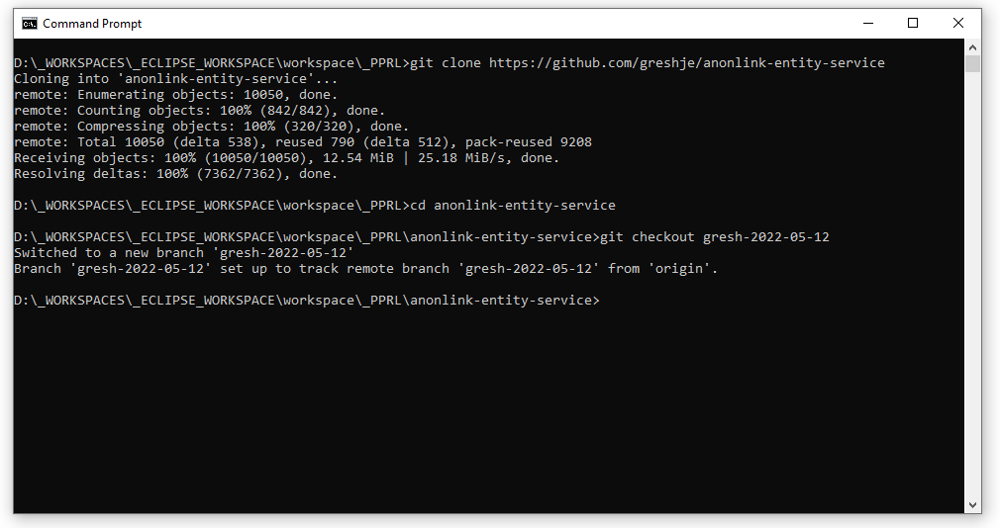
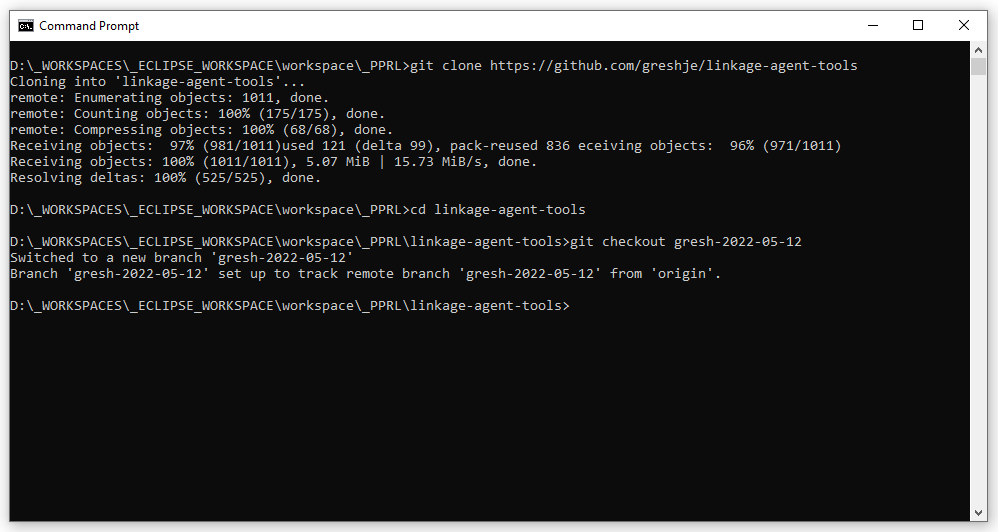

# Initial Setup and Install for Windows

This document walks through the exact steps required to successfully install and run link-agent-tools in a Windows environment.  

## Install Docker
Download and install Docker from here:
<br/>
[https://docs.docker.com/desktop/windows/install/](https://docs.docker.com/desktop/windows/install/)
<br/><br/>
<b>! ! ! The install executable must be run as administrator ! ! !</b>
<br/>
If the install is not run as administrator, some components (including some WSL and Linux virtual machine components) will not be properly installed.  
<br/>
<b>Notes on re-installing Docker</b>
<br/>
During the development process, it is not uncommon for the Docker environment to get corrupted. The Windows un-install program can be used to un-install Docker. However, <b>the un-install program does not un-install all of the data files used by docker.</b> Before running the un-install program, run the clean-docker.bat file from a cmd prompt. This file is located in the /win/bat folder of this project.  

## Clone and Checkout the Source Code
Create a folder to work out of (for example, I create a folder called _PPRL in my Eclipse workspace to hold the PPRL projects).  Create a fork/branch for your work.  Clone and check out the annon-link project and the link-agent-tools project.  

<b>Checkout and Clone Anonlink Example</b>

```
git clone https://github.com/greshje/anonlink-entity-service
cd anonlink-entity-service
git checkout gresh-2022-05-12
```

<p>
	
</p>

<b>Checkout and Clone Link Agent Tools Example</b>

```
git clone https://github.com/greshje/link-agent-tools
cd link-agent-tools
git checkout gresh-2022-05-12
```

<p>
	
</p>

## Make Changes to Anon Link Project
The folowing things need to be modified from the code currently check into the data61/anonlink-entity-service
<br/>
<br/>
<b>1.) Modify ./tools/build.sh</b>
<br/>
Uncomment the following line in ./tools/build.sh

```
#docker build -t data61/anonlink-base:latest base
```
<b>2.) Modifications of Version Numbers in ./base/Dockerfile</b>
<br/>
Make the following modifications to ./base/Dockerfile

```
python3=3.9.5-r2 \
python3-dev=3.9.5-r2 \
libpq=13.5-r0 \
postgresql-dev=13.5-r0 \
```
<b>3.) Modifications of Version numbers in ./tools/docker-compose.yml</b>
<br/>
Do a global search and replace.  
<br/>
Find:
<br/>
```data61/anonlink-app:${TAG:-latest}```
<br/>
Replace:
<br/>
```data61/anonlink-app:v1.15.1```

## Start Docker Desktop
Start Docker Desktop and wait for the container to start.  Once startup has completed you should see something like what is shown below.  
<p>
	
	
</p>

